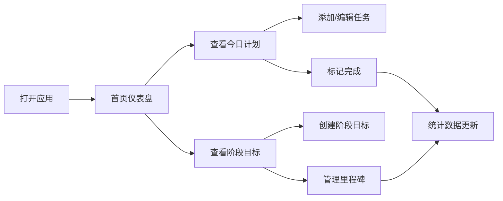

## 1. 产品概述

「计划本」是一款专注于个人计划管理的 Web 小程序，帮助用户高效记录每日待办事项与中长期阶段目标，通过清晰的时间线视图和完成度追踪，提升个人执行力与目标达成率。

- **核心价值**：将每日计划与阶段目标有机结合，让用户既能把握当下任务，又能聚焦长远目标
- **目标用户**：学生、职场人士、自由职业者等有计划管理需求的个人用户
- **产品定位**：轻量、优雅、高效的个人计划管理工具

## 2. 核心功能

### 2.1 用户角色

| 角色 | 注册方式 | 核心权限 |
|------|----------|----------|
| 普通用户 | 本地存储（无需注册） | 创建/编辑/删除计划、查看统计、设置偏好 |

### 2.2 功能模块

1. **首页仪表盘**：今日计划概览、阶段目标进度、快捷操作
2. **每日计划**：日期切换、任务列表、完成状态管理、优先级标记
3. **阶段计划**：目标列表、里程碑分解、进度追踪、时间轴视图
4. **数据统计**：完成率趋势、热力图、目标达成分析

### 2.3 页面详情

| 页面名称 | 模块名称 | 功能描述 |
|----------|----------|----------|
| 首页仪表盘 | 今日概览 | 展示今日待办数量、已完成数量、完成率环形图 |
| 首页仪表盘 | 快捷添加 | 快速创建每日任务或阶段目标 |
| 首页仪表盘 | 阶段进度 | 卡片式展示进行中的阶段目标及完成进度 |
| 每日计划页 | 日期导航 | 日历选择器、左右切换日期、回到今天 |
| 每日计划页 | 任务列表 | 任务项（标题、优先级、完成状态、删除）、分组显示 |
| 每日计划页 | 添加任务 | 任务标题、优先级（高/中/低）、备注、预计时长 |
| 阶段计划页 | 目标列表 | 阶段目标卡片（标题、时间范围、进度条、状态） |
| 阶段计划页 | 目标详情 | 里程碑分解、子任务列表、进度追踪时间轴 |
| 阶段计划页 | 创建目标 | 目标名称、起止日期、描述、里程碑设置 |
| 统计页面 | 完成率趋势 | 近7天/30天每日完成率折线图 |
| 统计页面 | 热力图 | 月度任务完成热力图 |
| 统计页面 | 目标分析 | 阶段目标达成率统计 |

## 3. 核心流程

### 3.1 每日计划流程
用户打开应用 → 查看今日待办列表 → 点击添加任务 → 填写任务信息 → 保存任务 → 完成任务后勾选 → 查看完成率更新

### 3.2 阶段计划流程
用户进入阶段计划页 → 点击创建目标 → 填写目标信息与里程碑 → 保存目标 → 在目标详情中管理子任务 → 查看进度更新 → 目标达成

## 4. 用户界面设计

### 4.1 设计风格

**设计理念**：温暖专注 · 简约精致 · 手写质感

- **主色调**：暖米色背景 (#FAF7F2)，深棕色文字 (#2D2A26)
- **强调色**：琥珀橙 (#E8923C) 用于高亮和进度，鼠尾草绿 (#7BA05B) 用于完成状态
- **辅助色**： dusty rose (#D4A5A5) 用于高优先级，灰蓝色 (#8FA8B8) 用于中优先级
- **按钮风格**：圆角胶囊形按钮，柔和阴影，悬停微放大效果
- **字体**：标题使用 'Noto Serif SC' 衬线体营造书写感，正文使用 'Noto Sans SC' 保证可读性
- **布局风格**：卡片式布局，柔和圆角，纸张质感阴影，留白充足
- **图标风格**：线性图标搭配柔和填充色，emoji 增强情感化表达

### 4.2 页面设计概览

| 页面名称 | 模块名称 | UI 元素 |
|----------|----------|---------|
| 首页仪表盘 | 今日概览 | 环形进度图、统计数字卡片、柔和渐变背景 |
| 首页仪表盘 | 快捷操作 | 浮动添加按钮、双选项切换（每日/阶段） |
| 首页仪表盘 | 阶段进度 | 横向滚动卡片组、进度条动画、emoji 图标 |
| 每日计划页 | 日期导航 | 日历头部、左右箭头、今日高亮、选中态 |
| 每日计划页 | 任务列表 | 卡片式任务项、优先级色标、勾选动画、滑动删除 |
| 每日计划页 | 添加弹窗 | 半透明遮罩、底部滑入表单、优先级选择器 |
| 阶段计划页 | 目标列表 | 瀑布流卡片、进度条渐变、状态标签、时间标注 |
| 阶段计划页 | 目标详情 | 时间轴布局、里程碑节点、连接线动画 |
| 统计页面 | 趋势图表 | SVG 折线图、渐变填充、数据点悬停提示 |
| 统计页面 | 热力图 | 7×N 网格、颜色深浅表示完成量、月份标注 |

### 4.3 响应式设计

- **设计原则**：移动端优先，桌面端扩展
- **断点设置**：移动端 (< 640px) 单列布局，平板 (640-1024px) 双列，桌面端 (> 1024px) 三列/侧边栏
- **触控优化**：按钮最小 44px 触控区域，列表项充足间距，滑动手势支持
- **底部导航**：移动端采用底部 Tab 栏（首页、每日、阶段、统计），桌面端侧边栏导航

### 4.4 动效设计

- **页面切换**：淡入淡出 + 轻微位移
- **任务完成**：勾选缩放动画 + 背景色过渡 + 轻微弹性效果
- **进度条**：从左到右填充动画，缓动曲线
- **添加任务**：从底部滑入 + 背景模糊遮罩淡入
- **卡片悬浮**：悬停时轻微上浮 + 阴影加深
