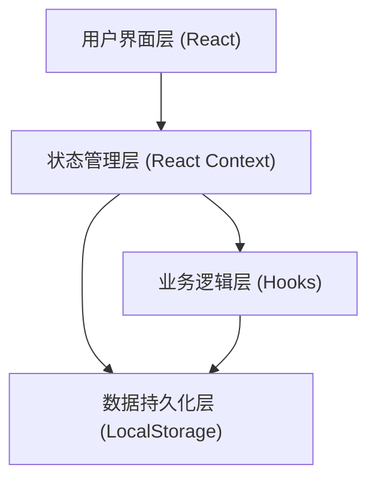
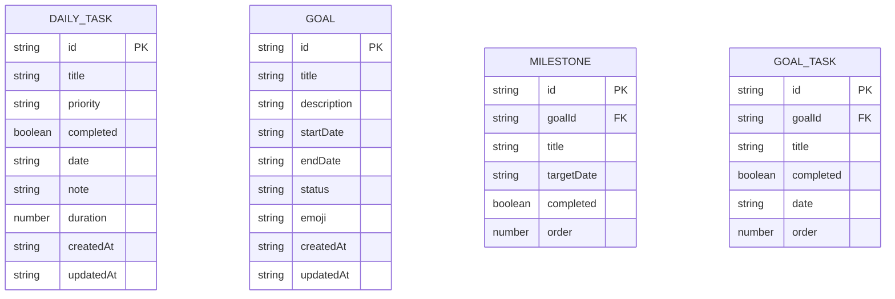

## 1. 架构设计



## 2. 技术选型说明

- **前端框架**：React@18 + TypeScript
- **构建工具**：Vite@5
- **样式方案**：TailwindCSS@3
- **路由管理**：React Router DOM@6
- **状态管理**：React Context + useReducer
- **数据存储**：LocalStorage（本地持久化，无需后端）
- **图表库**：原生 SVG 实现（轻量，减少依赖）
- **图标方案**：Lucide React

## 3. 路由定义

| 路由路径 | 页面名称 | 功能说明 |
|----------|----------|----------|
| `/` | 首页仪表盘 | 今日概览、快捷操作、阶段进度卡片 |
| `/daily` | 每日计划 | 日期导航、任务列表、添加/编辑任务 |
| `/goals` | 阶段计划 | 目标列表、创建目标、目标详情 |
| `/goals/:id` | 目标详情 | 里程碑、子任务、进度时间轴 |
| `/stats` | 数据统计 | 完成率趋势、热力图、目标分析 |

## 4. 数据模型

### 4.1 数据模型定义



### 4.2 数据结构定义

```typescript
// 每日任务
interface DailyTask {
  id: string;
  title: string;
  priority: 'high' | 'medium' | 'low';
  completed: boolean;
  date: string; // YYYY-MM-DD
  note?: string;
  duration?: number; // 分钟
  createdAt: string;
  updatedAt: string;
}

// 阶段目标
interface Goal {
  id: string;
  title: string;
  description?: string;
  startDate: string;
  endDate: string;
  status: 'active' | 'completed' | 'paused';
  emoji: string;
  createdAt: string;
  updatedAt: string;
}

// 里程碑
interface Milestone {
  id: string;
  goalId: string;
  title: string;
  targetDate?: string;
  completed: boolean;
  order: number;
}

// 目标子任务
interface GoalTask {
  id: string;
  goalId: string;
  title: string;
  completed: boolean;
  date?: string;
  order: number;
}

// 应用状态
interface AppState {
  dailyTasks: DailyTask[];
  goals: Goal[];
  milestones: Milestone[];
  goalTasks: GoalTask[];
  settings: {
    theme: 'light' | 'dark';
    startOfWeek: 'monday' | 'sunday';
  };
}
```

## 5. 项目目录结构

```
src/
├── components/          # 通用组件
│   ├── layout/         # 布局组件（导航、底部Tab栏）
│   ├── ui/             # UI 基础组件（按钮、卡片、输入框）
│   └── charts/         # 图表组件
├── pages/              # 页面组件
│   ├── Dashboard/      # 首页仪表盘
│   ├── Daily/          # 每日计划
│   ├── Goals/          # 阶段计划
│   └── Stats/          # 数据统计
├── context/            # 全局状态
│   └── AppContext.tsx
├── hooks/              # 自定义 Hooks
│   ├── useDailyTasks.ts
│   ├── useGoals.ts
│   └── useLocalStorage.ts
├── types/              # TypeScript 类型定义
│   └── index.ts
├── utils/              # 工具函数
│   ├── date.ts
│   ├── storage.ts
│   └── statistics.ts
├── App.tsx
├── main.tsx
└── index.css
```

## 6. 核心功能实现方案

### 6.1 本地存储方案
- 使用 LocalStorage 持久化所有数据
- 封装 `useLocalStorage` Hook 统一管理读写
- 应用启动时从 LocalStorage 加载数据
- 数据变更时自动同步到 LocalStorage

### 6.2 状态管理方案
- 使用 React Context 提供全局状态
- useReducer 处理复杂状态变更
- 按功能模块拆分 reducer 逻辑

### 6.3 日期处理
- 统一使用 `YYYY-MM-DD` 格式存储日期
- 封装日期工具函数（格式化、计算、范围判断）
- 支持周视图和月视图切换

### 6.4 统计计算
- 完成率：已完成任务数 / 总任务数
- 趋势数据：按日期聚合每日完成情况
- 热力图：最近 12 周数据可视化
